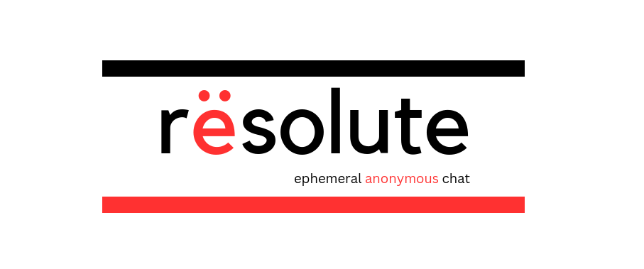

A simple chat service backend designed for short-term + anonymous conversations.

**Please note: This is a learning project. Use at your own risk. There's many steps yet to take for this to be ready for production.**

# Overview

Rësolute was started as a learning project to further my skills and understanding of secure and scalable communications systems. The project is not yet secure. I am first focusing on building out the core chat functionality.

In the future, I will be integrating E2EE, a solution(s) to forward secrecy, message padding and so on, to address security/privacy concerns. There is a lot of work to do.

Things are very likely to change drastically as I work towards these goals. **Stay tuned.**

Feel free to create an issue if you find a bug or want to suggest a feature.


# Usage

## Create Server

```go
package main

import (
	"fmt"

	"github.com/jessehorne/resolute/pkg/v1/resolute"
)

func main() {
	host := "127.0.0.1:5656"
	
	fmt.Println("listening on:", host)
	
	s := resolute.NewServer("/v1", host)
	if err := s.Listen(); err != nil {
		fmt.Println(err)
	}
}

```

# Client API Documentation

Please see [Client-API.md](./Client-API.md).

# License

See `./LICENSE`

more coming soon...
